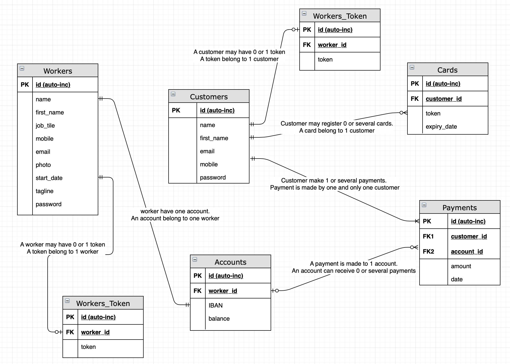

# <p align="center" style="color: green" size="40"> TripsEase Backend</p>

# What problem does this app solve?
Service workers often face challenges collecting tips from customers. Keeping track and sharing amongst colleagues can be overwhelming.
	
# How does your app solve the problem?

This web app will allow customers willing to give tips to a given service worker to give tips directly using using a service workers portal. Once the service workers identified on the portal, I payment can be processed directly from the portal and funds transferred to service worker account.
Service workers can at any point of time, sign-up to the portal, enter their profile and financial details to receive the fund, and check the dashboard to track their performance over time.


# What is the mission statement?
Help service workers to provide the greatest service possible without worrying about tips collections 
Features

# What features are required for your minimum viable product?
	* Service workers can sign-up on the platform, then create a profile with his service details as well as financial information to receive the funds tips to them
	* Service workers can transfert funds to each other as require
	* Service worker can withdraw	the tips received to their personal account
	* Customer can easily find a service worker by using the search engine
	* Customers can submit a payment to tip-off the selected service workers
	* Customer can leave a note as well as service rating optionally

# What features may you wish to put in a future release?
	* Service workers can close their account/profile at any point of time
	* Service worker can check their personal dashboard to track payments and performance
	* Automatic notification to service workers (SMS) upon receiving tips from customers.
	* Customer save payment card for future usage.
Frameworks - Libraries

# What 3rd party frameworks/libraries are you considering using?
	* ExpressJS, Knex, Jest, SQLite, Stripe API

Target Audience

# Who is the target audience?
	* Service workers at restaurents
	* Restaurants customers  

# The API

This is the back-end for the I'll serve soup, which is part of Lambda School Build Week Project.

<p align="center">
  
</p>

# Instructions

All API requests are made to: **_ https://kitchen-soup-backend.herokuapp.com _**

This api is using **https://sendgrid.com/** for sending emails.

If a Item amount is 0 the API will automatically send a messege to supplier with a messege

```
  to: 'supplier@example.com',
  from: 'currentUser@example.com',
  subject: 'Bananas out of stock',
  text: 'Need more Bananas!!',
```

## REGISTER (POST) User

a **POST** request to _/api/users/register_ will create a new user and return an object

`email must be in the form: anystring@anystring.anystring`

if not server will respond with :

```
{
    "message": "Please provide correct email for the user. Ex: anystring@anystring.anystring"
}
```

Form will need `name` , `password` , `email` and `role` that are require for registration a user
URL: /api/users/register

Example data:

```
{
    "name":"Sorin",
    "password":"123",
    "email":"sorin@yahoo.com",
    "role":"manager"
}

```

If posted succesfully, will return a object with message:

```

{
    "id": 5,
    "email": "sorin@yahoo.com",
    "message": "User: Sorin was registered succesfully"
}

```

If require field are not preset it will return a object with message:

```

{
    "message": "please provide name, password email and role for the user"
}

```